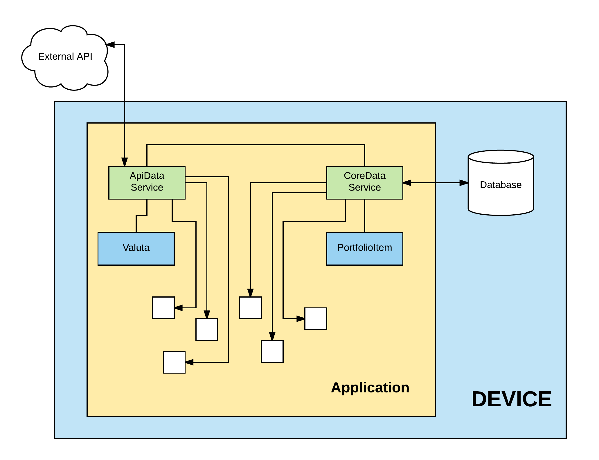

# Coin-portfolio - iOs app (PG5600 exam)
## 0 App description
Crypto currencies portfolio with features to add/remove and check trend of current portfolio. Demo application for people to try crypto currency market without material risk.  

## Video description
[youtube](https://youtu.be/TCMshkxlg1g)

## 1 Settings
* SWIFT 4
* Xcode 9.2

## 2 Pods
* [Alamofire](https://github.com/Alamofire/Alamofire)
* [AlamofireImage](https://github.com/Alamofire/AlamofireImage)
* [SwiftyJSON](https://github.com/SwiftyJSON/SwiftyJSON)

## 3 Diagram
Application core is two services
* CoreDataService - db communications
* ApiDataService - external api communications  
I used two representation of data for valuta and portfolio item for decoupling

## 4 Task
I fulfilled all requirenments for given exam tasks. I also implemented reveal view using trird party library. I mock login/registration feature and leave it for future improvements. Also I played with creating my own gradient element.   
1. It show 10 currencies, for each currency shows 7 things: symbol, name, picture, hour rate, day rate, week rate, price in nok  
2. Opportunity to add currency to portfolio, shows amount, persist portfolio with CoreData feature, show overview of portfolio inside market currency item, opportunity to add currency to portfolio multiple times (will update coreData)  
3. Opportunity to traverse bwtween portfolio and market via tabs, shows info on portfolio of each added currency, detailed overview of portfolio item, refresh button  
4. Shows properly portfolio items on portfolio tab   
5. Button refresh sync portfolio with market and sho update overview of all items  
6. Custom view of portfolio (header, portfolio overview total, table view with cells), editable cells (sweep cell to the left for removing)  

## 5 Comments
For refresh I used button, which call ApiDataService and refresh current list of valutas -> it is sync refresh for PortfolioVC and MarketVC. Cell in portfolio are editable, means user can swipe on cell and see additional menu. SWRevealController for feature navigation. I create custom header with gradient. I also persist images to be able show portfolio without internet connection. I finished 2 courses on udemy for iOs development, I mentioned them in sources

## 6 Sources  
* Coredata [https://cocoacasts.com/reading-and-updating-managed-objects-with-core-data/](https://cocoacasts.com/reading-and-updating-managed-objects-with-core-data/)
* RevealController [https://github.com/John-Lluch/SWRevealViewController](https://github.com/John-Lluch/SWRevealViewController)
* Gradient & API communication [https://www.udemy.com/devslopes-ios11/](https://www.udemy.com/devslopes-ios11/) 
* General knowledge iOS development and UI positioning [https://www.udemy.com/how-to-make-a-freaking-iphone-app-ios-11-and-swift-4-xcode-9/](https://www.udemy.com/how-to-make-a-freaking-iphone-app-ios-11-and-swift-4-xcode-9/) 
* Pods: Alamofire, AlamofireImage, SwiftyJSON use documentation on github  